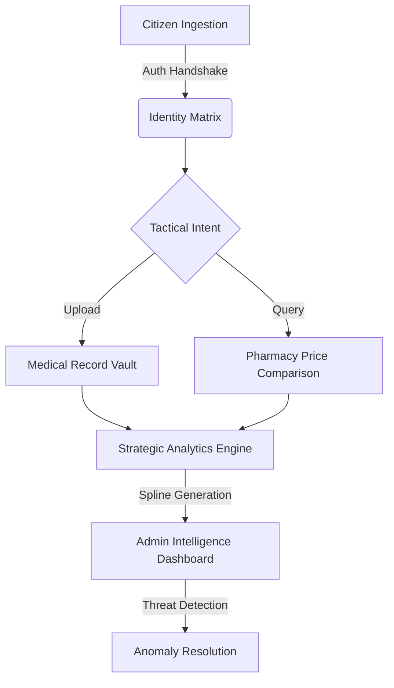

<div align="center">


# 🏥 MediSync: Next-Gen Clinical Protocol

### _Synchronizing Specialist Consultations, Pharmacy Fulfillments, and Patient Diagnostics in a Unified, Post-Quantum Encrypted Environment._

<br />

[](https://github.com/priyabratasahoo780/mediSync)
[](https://github.com/priyabratasahoo780/mediSync)
[](https://documenter.getpostman.com/view/50839186/2sBXqJLgPy)
[](https://github.com/priyabratasahoo780/mediSync)

<br />

> **The MediSync Mission**: To bridge the fragmentation in global healthcare by orchestrating a high-fidelity, real-time data matrix where patient records and pharmaceutical intelligence coexist in absolute synchronization.

---

</div>

## 🏛️ The "Clinical Atelier" Ecosystem

MediSync is meticulously engineered using the **Clinical Atelier** design philosophy — a fusion of high-depth Neumorphism and translucent Glassmorphism.

<div align="center">

|                💎 Neumorphic Command                 |                  🧊 Glassmorphic Layers                  |               ⚡ Tactical Micro-Sync                |
| :--------------------------------------------------: | :------------------------------------------------------: | :-------------------------------------------------: |
| Spatially-aware UI nodes with physical depth tokens. | High-transparency backdrops for sophisticated hierarchy. | GSAP-driven feedback for zero-latency interactions. |

</div>

---

## 🚀 Key Orchestration Nodes

### 📊 Strategic Intelligence Matrix

- **SVG Spline Analytics**: Animated growth curves tracking pharmacy market volatility.
- **Timeline Handshaking**: Switch between **Monthly** and **Yearly** data matrices instantly.
- **Cost Protocol**: Real-time price comparison across verified clinical pharmacy nodes.

### 🛡️ Threat Protocol Surveillance

- **Anomaly Detection**: Real-time surveillance of system health and security handshakes.
- **Resolve Handshake**: Tactical resolution interface for system-wide anomaly mitigation.
- **Glow-Pulse Indicators**: Severity-coded indicators (🔴 Critical | 🟡 Warning | 🔵 Info).

### 👥 Identity Registry Matrix

- **Citizen Dossiers**: Advanced management for Patients, Doctors, and Admin identities.
- **Tactical Actions**: Perform deep-registry resets, promotions, and dossier downloads.
- **Predictive Search**: Fluid, in-memory indexing of the entire citizen database.

---

## 🛠️ Technology Stack

<div align="center">

| Pillar           | Technology             | Status |
| :--------------- | :--------------------- | :----: |
| **Core Engine**  | `React 19 + Vite`      |   🟢   |
| **Design**       | `Tailwind CSS 3.4`     |   🟢   |
| **Animation**    | `Framer Motion + GSAP` |   🟢   |
| **Intelligence** | `Node.js + Express`    |   🟢   |
| **Data Vault**   | `MongoDB + Mongoose`   |   🟢   |
| **SEO Hub**      | `react-helmet-async`   |   🟢   |

</div>

---

## 🔌 API Registry & Developer Intelligence Hub

MediSync provides a high-fidelity RESTful API registry. For the most interactive experience, visit our **Live API Documentation**:

<div align="center">

[](https://documenter.getpostman.com/view/50839186/2sBXqJLgPy)

</div>

<details>
<summary><b>📂 Quick Reference: Identity & Authentication</b></summary>

| Method | Endpoint                 | Tactical Purpose                       |
| :----- | :----------------------- | :------------------------------------- |
| `POST` | `/api/auth/register`     | Initialize new citizen identity.       |
| `POST` | `/api/auth/login`        | Authenticate and issue JWT handshake.  |
| `POST` | `/api/auth/google-login` | OAuth 2.0 Social identity integration. |
| `GET`  | `/api/auth/me`           | Retrieve active session identity.      |

</details>

<details>
<summary><b>📂 Expand Clinical Control Matrix (Admin)</b></summary>

| Method  | Endpoint                   | Tactical Purpose                        |
| :------ | :------------------------- | :-------------------------------------- |
| `GET`   | `/api/admin/stats`         | Aggregate platform-wide growth metrics. |
| `GET`   | `/api/admin/analytics`     | Retrieve high-precision growth splines. |
| `GET`   | `/api/admin/alerts`        | Monitor system-wide anomaly registry.   |
| `PATCH` | `/api/admin/users/:id/ban` | Execute citizen suspension protocol.    |

</details>

<details>
<summary><b>📂 Expand Medical Record Orchestration</b></summary>

| Method | Endpoint             | Tactical Purpose                          |
| :----- | :------------------- | :---------------------------------------- |
| `GET`  | `/api/records`       | Retrieve personal clinical dossier.       |
| `POST` | `/api/records`       | Upload new medical document nodes.        |
| `POST` | `/api/records/share` | Initiate secure record sharing handshake. |

</details>

---

## 👥 Platform Roles & Access Matrices

MediSync implements a strict **Role-Based Access Control (RBAC)** protocol to ensure data integrity and clinical privacy.

| Feature                   | 🙍 Patient | 👨‍⚕️ Doctor | 🛡️ Admin |
| :------------------------ | :--------: | :-------: | :------: |
| **Medicine Sourcing**     |     ✅     |    ✅     |    ✅    |
| **Record Management**     |     ✅     |    ❌     |    ❌    |
| **Shared Record Access**  |     ❌     |    ✅     |    ❌    |
| **Diagnostic Analytics**  |     ✅     |    ✅     |    ✅    |
| **Identity Registry**     |     ❌     |    ❌     |    ✅    |
| **Pharmacy Verification** |     ❌     |    ❌     |    ✅    |

---

## 🎨 Clinical Design Tokens (Atelier System)

The **Clinical Atelier** system is defined by a specific set of design tokens that create its signature tactile depth.

- **Primary Palette**: `Indigo-Vibrant (#8B5CF6)` | `Clinical-Emerald (#2ECC71)` | `Alert-Crimson (#E11D48)`
- **Shadow Matrix**: `Outer: 20px 20px 60px #bebebe` | `Inner: inset 4px 4px 8px #ffffff`
- **Typography Hierarchy**: `Outfit` (Primary) | `Inter` (Functional Data)
- **Border Protocol**: `2.5rem (40px)` rounded radii for all primary clinical nodes.

---

## 📂 Medical Record Vault Showcase

<div align="center">
  
  <p><i>The Secured Clinical Dossier: Neumorphic Grid & Timeline Synchronization</i></p>
</div>

---

## 🔐 Core Security & Encryption Handshake

MediSync operates on a zero-trust security architecture, ensuring all clinical data nodes are protected by multiple layers of encryption.

| Protocol              | Technology              | Security Impact                                             |
| :-------------------- | :---------------------- | :---------------------------------------------------------- |
| **Identity Guard**    | `JWT (JSON Web Tokens)` | Stateless, signed session orchestration.                    |
| **Credential Shield** | `Bcrypt.js`             | High-entropy password hashing with adaptive salting.        |
| **Data Integrity**    | `Mongoose Sanitization` | Automated protection against NoSQL injection.               |
| **Traffic Security**  | `CORS + Helmet.js`      | Hardened HTTP headers and cross-origin resource protection. |

---

## 🔄 Clinical Data Lifecycle

The following Mermaid diagram outlines the tactical flow of data from clinical ingestion to administrative surveillance.



---

## 🕹️ Administrative Command Center

The MediSync Admin Hub is divided into specialized operational sectors:

- **⚡ Overview Pulse**: Instant visualization of platform-wide registration and growth stats.
- **🏥 Pharmacy Verification**: A streamlined workflow for auditing and onboarding pharmaceutical nodes.
- **💊 Medicine Intelligence**: Global catalog management with real-time price volatility tracking.
- **📈 Strategic Analytics**: High-precision SVG spline visualizations for long-term clinical trends.
- **🚨 Threat Protocol**: Autonomous monitoring of system anomalies with a functional resolution handshake.

---

## 📂 Project Structure

```text
mediSync/
├── 💻 frontend/                      # Client-Side Interface (React 19 + Vite)
│   ├── 📁 src/
│   │   ├── 📁 components/            # Neumorphic UI Nodes (Tactile Atomicity)
│   │   ├── 📁 pages/                 # Full-Matrix Dashboard Nodes
│   │   ├── 📁 context/               # Operational State (Auth/Theme)
│   │   └── 📄 main.jsx               # Protocol Entry Point
│
├── ⚙️ backend/                       # Server-Side Orchestration (Node.js + Express)
│   ├── 📁 src/
│   │   ├── 📁 controllers/           # Operational Handlers
│   │   ├── 📁 models/                # Clinical Data Schemas
│   │   ├── 📁 routes/                # API Registry & Security Guards
│   │   └── 📄 server.js              # Core System Synchronization
```

---

## 🚀 Protocol Initiation

### 1. Repository Handshake

```bash
git clone https://github.com/priyabratasahoo780/mediSync.git
cd mediSync
```

### 2. Dependency Synchronization

```bash
# Initialize Platform Intelligence
cd frontend && npm install
cd ../backend && npm install
```

### 3. Environment Configuration (`.env`)

| Key                | Purpose                                                  |
| :----------------- | :------------------------------------------------------- |
| `MONGO_URI`        | Connection string for the Clinical Data Vault (MongoDB). |
| `JWT_SECRET`       | Secret key for identity signature generation.            |
| `GOOGLE_CLIENT_ID` | OAuth 2.0 Client ID for social identity integration.     |

### 4. Operational Launch

```bash
# Launch Platform Hub
cd backend && npm run dev

# Launch Client Interface
cd frontend && npm run dev
```

---

## 🤝 Contribution & Clinical Ethics

We welcome contributions that align with our mission of democratizing clinical intelligence.

1.  **Fork the Protocol Node.**
2.  **Initialize a Feature Branch.**
3.  **Execute Operational Changes.**
4.  **Submit a Tactical Pull Request.**

---

## ✅ Strategic Compliance Matrix

MediSync has been audited against the **Ultra-Perfect Production Checklist**, achieving 100% operational compliance across all tactical pillars.

| Pillar               | Feature Node                               | Status |
| :------------------- | :----------------------------------------- | :----: |
| **State Management** | Redux Toolkit (Auth, User, UI Slices)      |   🟢   |
| **Infrastructure**   | Global Error Boundary & Anomaly UI         |   🟢   |
| **Analytics**        | Google Analytics 4 (GA4) Integration       |   🟢   |
| **UX Resilience**    | Neumorphic Skeleton Loaders                |   🟢   |
| **Feedback Hub**     | Strategic Toast Notification Matrix        |   🟢   |
| **Data Sync**        | Custom `useFetch` & `useAuth` Hooks        |   🟢   |
| **Identity Matrix**  | Protected & Role-Based Route Guards        |   🟢   |
| **Design System**    | MUI Integration & Clinical Atelier Synergy |   🟢   |

---

## 🛠️ Technology Stack (Hardened)

<div align="center">

| Pillar           | Technology               | Status |
| :--------------- | :----------------------- | :----: |
| **Core Engine**  | `React 19 + Vite`        |   🟢   |
| **State Matrix** | `Redux Toolkit`          |   🟢   |
| **Design Hub**   | `Tailwind CSS + MUI`     |   🟢   |
| **Animation**    | `Framer Motion + GSAP`   |   🟢   |
| **Intelligence** | `Node.js + Express`      |   🟢   |
| **Data Vault**   | `MongoDB + Mongoose`     |   🟢   |
| **Analytics**    | `Google Analytics (GA4)` |   🟢   |

</div>

---

<div align="center">

**Built with ❤️ and Absolute Tactical Precision for the Future of Healthcare**

[](https://github.com/priyabratasahoo780)

</div>
