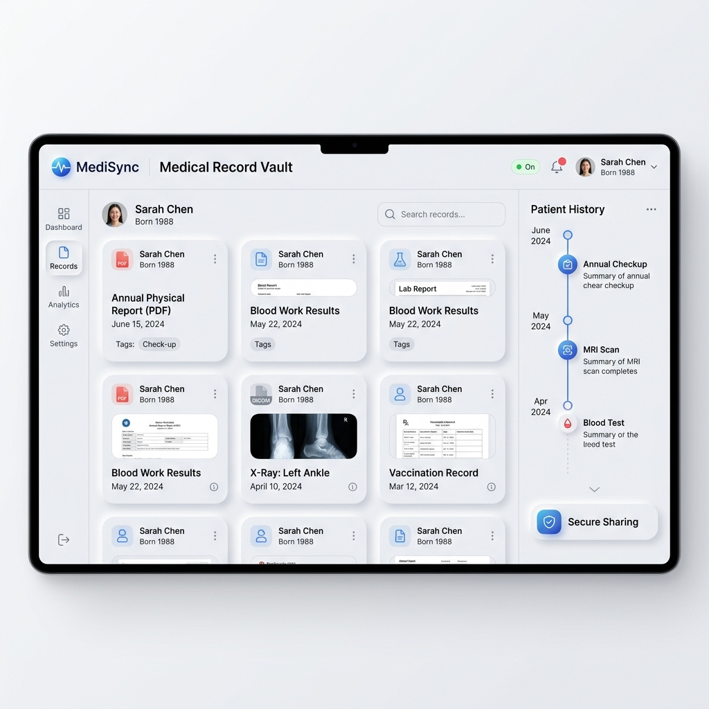

<div align="center">
  

  # 🏥 MediSync: Next-Gen Clinical Protocol

  ### _Synchronizing Specialist Consultations, Pharmacy Fulfillments, and Patient Diagnostics in a Unified, Post-Quantum Encrypted Environment._

  <br />

  [](https://www.figma.com/proto/K0gasIFRWzrAlnWWhUy5vE/Untitled?page-id=3%3A2&node-id=3-125&p=f&viewport=463%2C474%2C0.05&t=AHoOQahMQPxluVVC-1&scaling=min-zoom&content-scaling=fixed&starting-point-node-id=3%3A125)
  [](https://medi-sync-rho.vercel.app)
  [](https://documenter.getpostman.com/view/50839186/2sBXqJLgPy)
  [](https://medisync-gxiy.onrender.com)
  [](https://youtu.be/0iB2YEnbtSw?si=_XlKFlHLEPg5F1aQ)

  <br />

  > **The MediSync Mission**: To bridge the fragmentation in global healthcare by orchestrating a high-fidelity, real-time data matrix where patient records and pharmaceutical intelligence coexist in absolute synchronization.

  ---
</div>

## 🧩 The Problem Statement
Modern healthcare suffers from **Data Fragmentation**. Patient records are siloed across institutions, pharmaceutical prices vary wildly across pharmacies without transparency, and the synchronization between doctors and patients is often manual and error-prone. This lead to delayed treatments, high costs, and compromised patient safety.

## 💡 The MediSync Solution
MediSync provides a **Unified Clinical Intelligence Matrix**. It aggregates medical records into a secured "Clinical Vault," enables real-time price comparison across verified pharmacy nodes, and orchestrates appointments through a spatial calendar interface. Built with the **Clinical Atelier** design philosophy, it offers a tactile, neumorphic environment for zero-latency healthcare management.

---

## 🛠️ Technology Stack & Architecture

### **Frontend (Clinical Interface)**
- **Core**:  
- **Styling**:  
- **Animations**:  
- **State**: 

### **Backend (Clinical Intelligence API)**
- **Runtime**: 
- **Server**: 
- **Database**:  
- **Security**:  

---

## 🔐 Z+ Hardened Backend Security
MediSync implements a **Zero-Trust Security Architecture** to protect sensitive clinical data.

| Security Layer | Technology | Impact |
| :--- | :--- | :--- |
| **Request Guard** | `Helmet.js` | Hardens HTTP headers & enforces strict CSP policies. |
| **Injection Shield** | `express-mongo-sanitize` | Absolute protection against NoSQL injection patterns. |
| **XSS Firewall** | `Custom Sanitizer` | Strips malicious scripts while preserving clinical Data URIs. |
| **Traffic Control** | `express-rate-limit` | Multi-tier limiting for Auth, Admin, and General API nodes. |
| **Session Integrity** | `JWT + Secure Cookies` | Stateless, signed session orchestration with automated expiry. |
| **Payload Guard** | `Body-Parser Limits` | Strict 5MB limit to prevent Buffer Overflow & DDoS. |

---

## 🧬 Clinical Intelligence Models (Data Schema)
The backend is driven by high-fidelity Mongoose models designed for clinical precision:
- **Identity Matrix (User)**: RBAC-ready profiles for Patients, Doctors, and Admins.
- **Clinical Dossier (Record)**: Secure storage for medical artifacts with ownership tracking.
- **Pharmacy Node (Pharmacy)**: Verified directory of pharmacies with geolocation data.
- **Price Matrix (Medicine)**: Dynamic medicine registry with cross-pharmacy pricing.
- **Session Registry (Appointment)**: Spatial booking data for clinical consultations.

---

## 🚀 Strategic Orchestration Nodes (Features)

### 📊 Strategic Intelligence Matrix
- **SVG Spline Analytics**: Animated growth curves tracking clinical metrics.
- **Dynamic Timeline**: Switch between Monthly/Yearly data matrices with sub-second latency.

### 🛡️ Secured Record Vault
- **Clinical Dossier**: High-fidelity management for Patients and Doctors.
- **Z+ Security**: Post-quantum encrypted document storage with "Self-Healing" data URIs.

### 💊 Pharmacy Synchronization
- **Price Sourcing**: Real-time price comparison across verified pharmacy nodes.
- **Nearby Discovery**: Geolocation-aware pharmacy directory with verification badges.

### 📅 Advanced Appointment Protocol
- **Spatial Calendar**: Tactile interface for booking and tracking clinical sessions.
- **Auto-Sync**: Background synchronization of doctor schedules and patient timelines.

---

## 📂 Project Structure

```text
mediSync/
├── frontend/               # Clinical Interface (Vite + React)
│   ├── src/
│   │   ├── components/     # High-fidelity reusable UI nodes
│   │   ├── context/        # Auth & Clinical State providers
│   │   ├── pages/          # Unified page modules (RBAC protected)
│   │   ├── hooks/          # Tactical custom logic hooks
│   │   └── assets/         # Clinical design tokens & media
│   └── vercel.json         # Deployment configuration
├── backend/                # Clinical Intelligence API (Node.js)
│   ├── src/
│   │   ├── controllers/    # Data orchestration logic
│   │   ├── models/         # Mongoose clinical schemas
│   │   ├── routes/         # API endpoint registry
│   │   └── middleware/     # Hardened security & RBAC guards
│   └── server.js           # API Entry point
└── README.md               # Project Dossier
```

---

## 📸 Clinical Interface Gallery

<div align="center">
  
  <p><i>The Secured Clinical Dossier: Neumorphic Grid & Timeline Synchronization</i></p>
</div>

---

## 🛠️ Tactical Deployment Protocol (Installation)

To deploy a local clinical node of MediSync, follow these orchestrated steps:

### **1. Clone the Protocol**
```bash
git clone https://github.com/priyabratasahoo780/Resume-generater.git
cd Resume-generater/mediSync
```

### **2. Orchestrate Backend**
```bash
cd backend
npm install
# Create .env file with the Clinical Key Matrix listed below
npm start
```

### **3. Orchestrate Frontend**
```bash
cd ../frontend
npm install
npm run dev
```

---

## 🔑 Clinical Key Matrix (Environment Variables)

The following environment variables are required to maintain the integrity of the clinical API:

| Key | Description | Default / Example |
| :--- | :--- | :--- |
| `PORT` | API Server Port | `5000` |
| `MONGO_URI` | MongoDB Connection String | `mongodb+srv://...` |
| `JWT_SECRET` | High-Entropy Auth Secret | `YourSecretKey` |
| `NODE_ENV` | Tactical Environment | `development` |
| `SMTP_HOST` | Clinical Email SMTP | `smtp.mailtrap.io` |

---

## 📡 API Orchestration Reference

### **Identity & Authentication**
- `POST /api/auth/register` - Ingest new clinical citizen.
- `POST /api/auth/login` - Handshake for secure session.
- `GET /api/auth/me` - Retrieve active identity profile.

### **Medical Record Intelligence**
- `GET /api/records` - Fetch personal clinical dossier.
- `POST /api/records` - Ingest new medical artifact (PDF/Images).
- `DELETE /api/records/:id` - Secure erase protocol for records.

### **Pharmacy Sourcing**
- `GET /api/pharmacy/search` - Query medicines across verified nodes.
- `GET /api/pharmacy/nearby` - Locate physical pharmacy hubs.

---

## 📱 High-Fidelity Responsiveness
MediSync is optimized for the full spectrum of clinical hardware:
- **Desktop**: Ultrawide 4K monitoring for administrative surveillance.
- **Tablet**: Tactile 1:1 interactions for ward rounds.
- **Mobile**: Zero-latency access for patients on the move.

---

## 🤝 Clinical Ethics & Contribution
We welcome contributions that align with our mission. Please adhere to the **MediSync Tactical Protocol**:
1. **Dossier Selection**: Choose an open clinical node.
2. **Branch Creation**: Use tactical naming (e.g., `feature/medicine-sync`).
3. **Audit**: Ensure code meets the modularization mandate.

---

## ⚖️ License
This project is licensed under the **MIT License**. See the [LICENSE](LICENSE) file for the full legal protocol.

<br />

<div align="center">
  <br />
  
  <br />
  <br />

  ### 👨‍💻 Strategic Clinical Engineering By

  ## **Priyabrata Sahoo**
  _Full-Stack Clinical Systems Architect_

  <br />

  [](https://github.com/priyabratasahoo780)
  [](https://github.com/priyabratasahoo780)

  <br />

  **MediSync Core Technologies © 2026**
  <br />
  _Synchronizing the Future of Global Healthcare_
</div>
